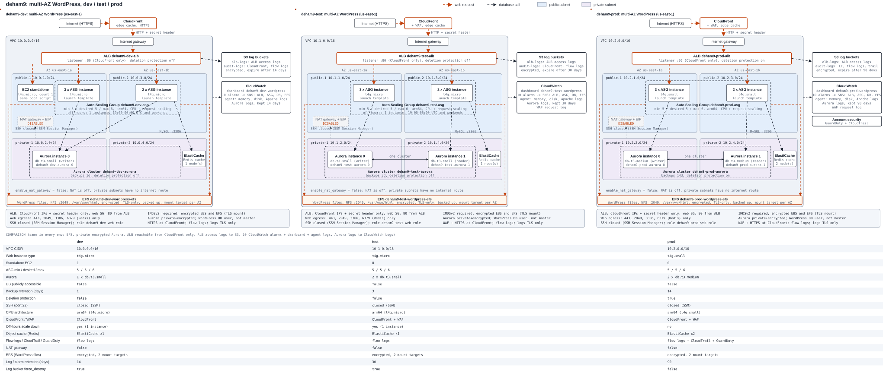

# Scalable and Fault-Tolerant WordPress on AWS

A turnkey Terraform solution that deploys a scalable, fault-tolerant WordPress website on AWS, built with VS Code, Terraform, Git and GitHub following the Scrum methodology.



The diagram is animated: arrows flow and dots travel along the request path (CloudFront, ALB, web instances, database, cache, EFS). Static versions and per-environment diagrams: [all](docs/architecture-all-environments.svg), [dev](docs/architecture-dev.svg), [test](docs/architecture-test.svg), [prod](docs/architecture-prod.svg); animated per environment: [dev](docs/architecture-dev-animated.svg), [test](docs/architecture-test-animated.svg), [prod](docs/architecture-prod-animated.svg). All are generated from the `terraform.tfvars` files with `python docs/gen_diagrams.py`.

## What it deploys

- **Edge**: CloudFront (HTTPS on its own domain name, edge caching) with WAF in test and prod. The load balancer only accepts traffic from CloudFront, and only with a secret header.
- **Web tier**: an Auto Scaling Group of Graviton (arm64) instances running the latest Amazon Linux 2023 in two Availability Zones, scaling on CPU and request count. Dev and test scale down outside working hours.
- **WordPress files**: one encrypted, backed-up EFS file system mounted by every instance, so all instances serve the same code, plugins and uploads. The first instance to boot installs WordPress onto it.
- **Data**: Aurora MySQL (MySQL 8.0) in private subnets, with AWS-managed credentials in Secrets Manager, and an ElastiCache Redis object cache.
- **Observability**: CloudWatch dashboard, 10 alarms notifying an SNS topic, CloudWatch agent (memory, disk, Apache logs), Aurora and WAF logs, ALB and CloudFront access logs in S3, VPC Flow Logs; CloudTrail and GuardDuty in prod.
- **Security**: SSH closed (SSM Session Manager), IMDSv2, encrypted storage everywhere, least-privilege IAM role created by Terraform, restricted security-group egress, TLS-only buckets. Details in [DOCUMENTATION.md](DOCUMENTATION.md).

## Layout

```text
modules/wordpress/     shared module: network, security groups, ALB, ASG, EFS, Aurora, Redis, CloudFront/WAF, S3, CloudWatch, tests/
environments/dev/      dev   - 10.0.0.0/16, 1 standalone EC2 + 5 web instances, 1 Aurora instance
environments/test/     test  - 10.1.0.0/16, 5 web instances, 2 Aurora instances, WAF
environments/prod/     prod  - 10.2.0.0/16, 5 web instances (t4g.small), db.t3.medium x2, WAF, CloudTrail, GuardDuty, deletion protection
bootstrap/             one-off S3 state bucket + DynamoDB lock table
docs/                  architecture diagrams and the script that generates them
```

Each environment directory has its own state and `terraform.tfvars`; resources are named `deham9-<env>-...`, so all three can share one AWS account.

## Quick start

Prerequisites: Terraform >= 1.7, AWS CLI with credentials, and an EC2 key pair named `deham9-iam` in `us-east-1`.

```bash
cd environments/<dev|test|prod>
terraform init
terraform plan
terraform apply
terraform output site_url      # open this URL; the first visit shows the WordPress installer
```

Or run one environment by argument:

```text
./deploy.sh dev plan                          # Git Bash / WSL
./deploy.sh dev apply
.\deploy.ps1 -Environment dev -Action apply   # PowerShell
```

Arguments: `<dev|test|prod> <init|plan|apply|destroy|output|validate>`; extra arguments are passed to Terraform. Only the chosen environment is touched.

## Tests and CI

```bash
cd modules/wordpress && terraform init -backend=false && terraform test   # mocked provider, no credentials
./load-test.sh <env>                                                      # needs a deployed environment
```

GitHub Actions runs the format check, the unit tests, `terraform validate`, a Checkov scan and a check that the diagrams are up to date.

## Documentation

[DOCUMENTATION.md](DOCUMENTATION.md) has the architecture, every component, the security model, deployment and operations guides, the cost estimate and troubleshooting. [CLAUDE.md](CLAUDE.md) is the working guide for AI coding assistants.
