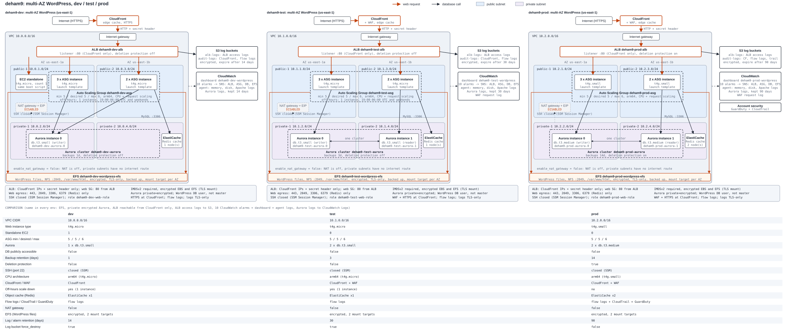
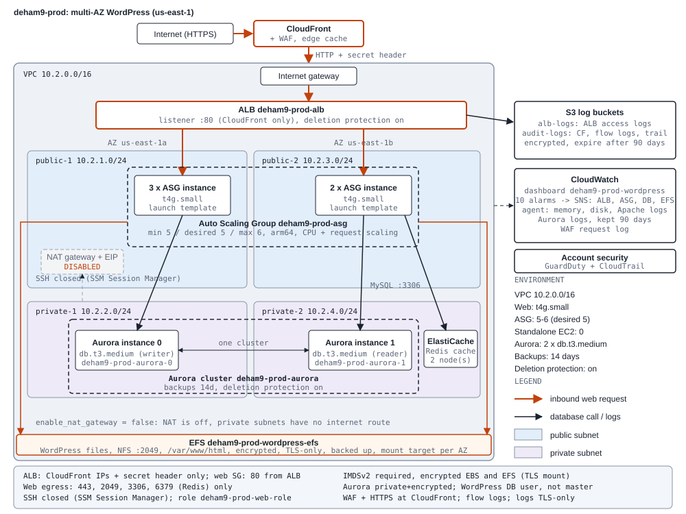
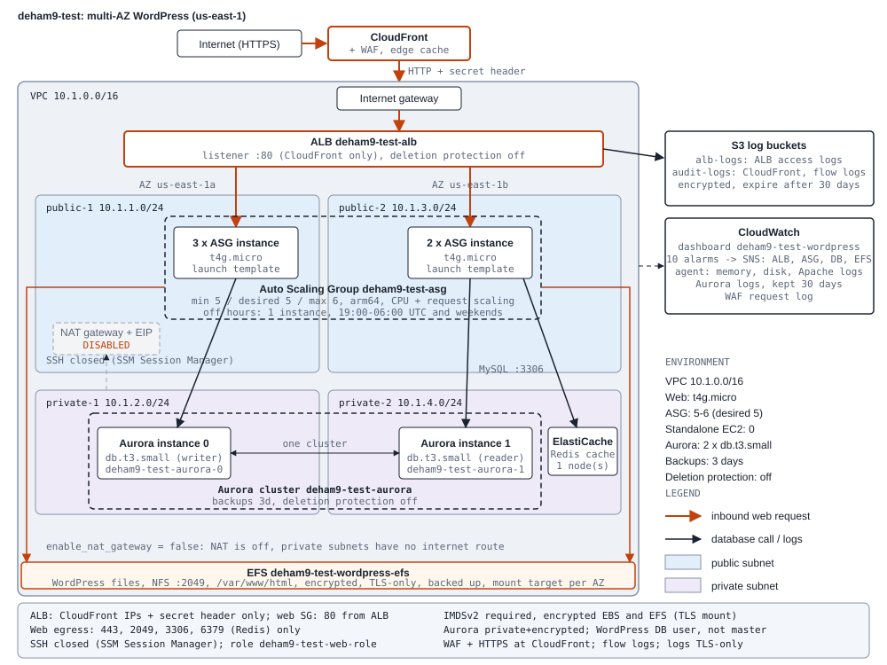
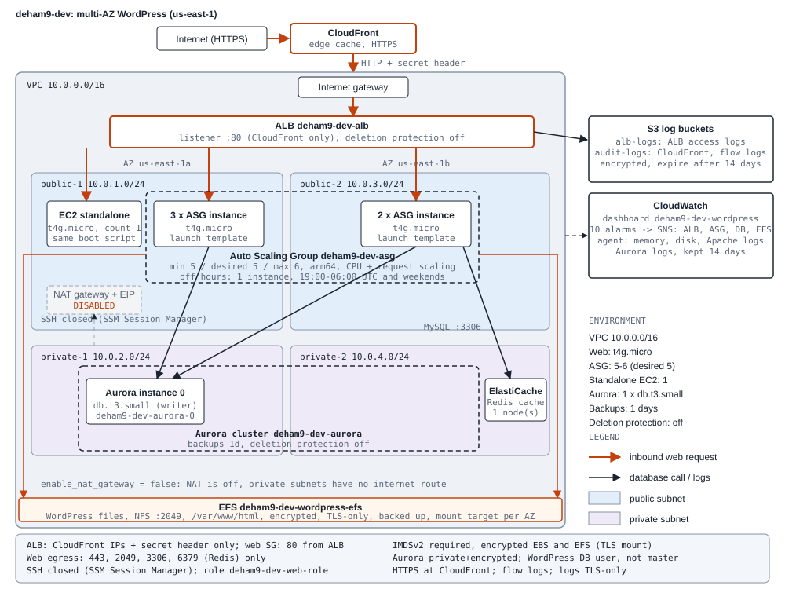
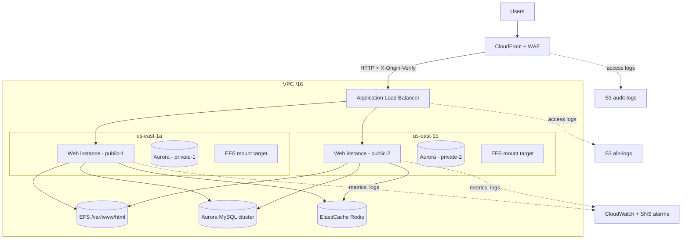

# Technical Design Specification: Multi-AZ WordPress on AWS

Date: 2026-10-10. Implements [BUSINESS_REQUIREMENTS.md](BUSINESS_REQUIREMENTS.md); verified by [TEST_CASES.md](TEST_CASES.md). Diagrams: `docs/architecture-*.svg`.

## 1. Overview

A shared Terraform module (`modules/wordpress`) is called by three environments (`environments/dev|test|prod`), each with its own state and `terraform.tfvars`. It deploys a multi-AZ WordPress site in us-east-1 (AZs us-east-1a and us-east-1b).

| Item | Choice |
| --- | --- |
| IaC | Terraform, AWS provider `~> 5.0`, random provider `~> 3.0` |
| Region | us-east-1 (required for the CloudFront WAF) |
| Naming | `<project>-<env>`, for example `deham9-prod`; ALB and target group names are limited to 32 characters |
| Application | WordPress installed by the instance boot script (no custom application code) |
| State | Local by default; `bootstrap/` creates an S3 bucket and DynamoDB lock table for remote state |

## 2. Architecture

```text
Internet -> CloudFront (+WAF) -> ALB (X-Origin-Verify header required) -> ASG web instances (public-1 / public-2)
                                                                       |-> EFS /var/www/html (mount target per AZ)
                                                                       |-> Aurora MySQL (private-1 / private-2)
                                                                       |-> ElastiCache Redis (private subnets)
Logs: ALB -> S3 alb-logs; CloudFront + VPC Flow Logs (+CloudTrail in prod) -> S3 audit-logs; WAF, Apache, Aurora -> CloudWatch Logs
```

Request flow: CloudFront terminates HTTPS and forwards over HTTP to the ALB with a secret `X-Origin-Verify` header. The ALB listener returns 403 by default and forwards only requests carrying that header. Web instances read and write WordPress files on EFS, query Aurora, and use Redis as the object cache.

### 2.1 Architecture diagrams

Generated from the tfvars by `python docs/gen_diagrams.py` (CI fails if they are stale). Each has an animated variant (`*-animated.svg`) showing request flow.

#### All environments



#### Production



#### Test



#### Development



### 2.2 Logical view



## 3. Component design

### 3.1 Network (`network.tf`)

- One VPC per environment: dev 10.0.0.0/16, test 10.1.0.0/16, prod 10.2.0.0/16.
- Four /24 subnets from `cidrsubnet`: two public (web, ALB, EFS mount targets) and two private (Aurora, Redis), one of each per AZ.
- Internet gateway and route tables. The NAT gateway and EIP exist only when `enable_nat_gateway = true` (false in all environments), so web instances use public IPs for outbound access.

### 3.2 Edge: CloudFront and WAF (`cloudfront.tf`)

- Origin is the ALB over HTTP only; viewers are redirected to HTTPS. Default certificate `*.cloudfront.net`, or an ACM certificate in us-east-1 for a custom domain.
- Dynamic pages use the managed CachingDisabled policy; `/wp-content/*` and `/wp-includes/*` use CachingOptimized. Price class default `PriceClass_100`. Access logs go to the audit bucket.
- Origin secret: a `random_password` sent as `X-Origin-Verify`.
- WAFv2 ACL (`enable_waf`; test and prod): managed Common, KnownBadInputs and SQLi rule sets plus a per-IP rate limit (`waf_rate_limit`, default 2000 requests per 5 minutes). Logs go to a CloudWatch log group `aws-waf-logs-<prefix>` with authorization and cookie headers redacted.

### 3.3 Load balancer (`elb.tf`)

- ALB `<prefix>-alb` across both public subnets; drops invalid headers; access logs to S3.
- Target group `<prefix>-tg`, health check on `/`, matcher 200-399 (a fresh WordPress redirects to its installer).
- HTTP listener always. HTTPS listener only with `certificate_arn` and without CloudFront. With CloudFront, a listener rule forwards requests with the origin header.

### 3.4 Compute (`auto_scaling.tf`, `ec2.tf`, `iam.tf`, `userdatalaunchtemplate.tpl`)

- Launch template: latest Amazon Linux 2023 AMI for `cpu_architecture` (SSM public parameter; `ami_id` pins one), Graviton arm64 with t4g types, IMDSv2 required, encrypted root volume, detailed monitoring. A precondition fails the plan if the instance type does not match the architecture.
- ASG `<prefix>-asg`: ELB health checks, 300 s grace period, rolling `instance_refresh` on the launch template's latest version, `desired_capacity` ignored in lifecycle so scaling is not reverted.
- Scaling policies: target tracking on average CPU (`cpu_target_value`, default 70%) and on `ALBRequestCountPerTarget` (`request_count_target`, default 1000). Optional off-hours schedule (default scale down 19:00 UTC, up 06:00 UTC Mon-Fri, `off_hours_capacity`).
- Dev also runs one standalone EC2 instance (`standalone_instance_count`) with the same boot script, attached to the target group.
- IAM role `<prefix>-web-role` and instance profile: SSM core, CloudWatch agent, and `GetSecretValue` on the Aurora secret.

**Boot script.** Installs packages, mounts EFS over TLS, then the first instance to win an atomic `mkdir` lock (10-minute stale-lock takeover) installs WordPress with a dedicated `wordpress` database user (never the rotating master password), generated salts, proxy settings and optional Redis settings. It then starts Apache and the CloudWatch agent. It is rendered with `templatefile()`, so literal `${...}` must be written `$${...}`, and it must never print passwords.

### 3.5 Database (`rds.tf`)

- Aurora MySQL cluster `<prefix>-aurora` in the private subnets; engine is the latest Aurora MySQL 3 (8.0) unless `db_engine_version` pins one; storage encrypted.
- Master password managed by Secrets Manager (`manage_master_user_password`); no password in code or state outputs.
- `db_instance_count` instances alternate over the AZs. Error and slow-query logs export to CloudWatch.
- Prod: deletion protection and a final snapshot; backup retention is set per environment.

### 3.6 Shared storage (`efs.tf`)

Encrypted EFS with elastic throughput, backup policy, a resource policy allowing mounts over TLS only, one mount target per public subnet, and NFS (2049) allowed from the web security group only. Mounted at `/var/www/html`.

### 3.7 Object cache (`cache.tf`)

Optional ElastiCache Redis (`enable_object_cache`) in the private subnets with in-transit and at-rest encryption; port 6379 from the web security group only.

### 3.8 Storage, audit and monitoring (`s3.tf`, `audit.tf`, `monitoring.tf`)

- S3 `<prefix>-alb-logs-<account id>`: versioning, public access block, SSE-S3, lifecycle expiry `log_retention_days`, bucket policy for the ELB service account.
- S3 `<prefix>-audit-logs-<account id>`: ACLs enabled for CloudFront logging, TLS-only. Receives VPC Flow Logs (`enable_flow_logs`) and CloudTrail (`enable_cloudtrail`). GuardDuty (`enable_guardduty`) and CloudTrail are account-level and enabled in prod only (one detector per account and region).
- SNS topic `<prefix>-alarms` (email subscription only when `alarm_email` is set), 10 CloudWatch alarms and the `<prefix>-wordpress` dashboard.

| Alarm | Condition | Window |
| --- | --- | --- |
| alb-5xx | above 5 | 3 x 60 s |
| target-5xx | above 10 | 3 x 60 s |
| unhealthy-hosts | at or above 1 | 3 x 60 s |
| response-time | above 2 s | 5 x 60 s |
| asg-cpu-high | above 85% | 5 x 60 s |
| asg-memory-high | above 85% | 5 x 60 s |
| db-cpu-high | above 80% | 5 x 60 s |
| db-connections-high | above 100 | 5 x 60 s |
| db-memory-low | below 256 MB | 5 x 60 s |
| efs-io-limit | above 90% | 3 x 300 s |

## 4. Security design

| Control | Design |
| --- | --- |
| Perimeter | CloudFront plus WAF; ALB accepts port 80 from the CloudFront prefix list only and requires the origin header |
| Security groups | ALB: egress to the VPC CIDR. Web: 80 from ALB; egress 443, 2049, 3306 (and 6379 with cache). Aurora: 3306 from web. EFS: 2049 from web. Redis: 6379 from web. SSH group has a rule only when `ssh_cidr_blocks` is set (default empty) |
| Admin access | SSM Session Manager; port 22 closed |
| Encryption | At rest: Aurora, EFS, root volumes, Redis, S3. In transit: HTTPS at the edge, TLS-only EFS mounts, Redis TLS, TLS-only audit bucket |
| Secrets | Aurora master password in Secrets Manager; WordPress uses its own DB user; origin secret generated by Terraform |
| Instance hardening | IMDSv2 required; patched AMI on each launch; least-privilege instance role |
| Audit | VPC Flow Logs; CloudTrail and GuardDuty in prod; WAF logs in CloudWatch |

## 5. Environment configuration

| Setting | dev | test | prod |
| --- | --- | --- | --- |
| VPC CIDR | 10.0.0.0/16 | 10.1.0.0/16 | 10.2.0.0/16 |
| Web instance type | t4g.micro | t4g.micro | t4g.small |
| ASG min / desired / max | 5 / 5 / 6 | 5 / 5 / 6 | 5 / 5 / 6 |
| Standalone EC2 | 1 | 0 | 0 |
| Aurora class x instances | db.t3.small x 1 | db.t3.small x 2 | db.t3.medium x 2 |
| Backup retention (days) | 1 | 3 | 14 |
| Deletion protection | off | off | on |
| WAF | off | on | on |
| Redis nodes | 1 | 1 | 2 |
| Off-hours schedule | on | on | off |
| Flow logs / CloudTrail / GuardDuty | on / off / off | on / off / off | on / on / on |
| Log retention (days) | 14 | 30 | 90 |

## 6. Variables and interfaces

- Module inputs are defined in `modules/wordpress/variables.tf`. A new variable must be added to each environment's `variables.tf`, `main.tf` and `terraform.tfvars`.
- Module outputs are in `modules/wordpress/outputs.tf` and repeated in each `environments/*/outputs.tf`. The browsable address is the `site_url` output (the ALB DNS name is not browsable with CloudFront).
- Deploy with `./deploy.sh <env> <action>` or `deploy.ps1`; or run `terraform init/plan/apply` in the environment directory.

## 7. Quality and delivery

- `terraform fmt`, `terraform validate` and `terraform test` (mock provider, `command = plan`, Terraform 1.7 or later) in `modules/wordpress/tests/`.
- CI (`.github/workflows/terraform.yml`): fmt, tests, validate for all environments and bootstrap, Checkov (soft fail), diagram freshness (`python docs/gen_diagrams.py`).
- Load testing: `./load-test.sh <env>` or `locustfile.py`.

## 8. Tools and technologies

| Area | Tool or technology | Use |
| --- | --- | --- |
| Infrastructure as code | Terraform (AWS provider ~> 5.0, random ~> 3.0) | Defines and deploys all resources; modules plus per-environment state |
| Cloud platform | AWS, region us-east-1 | Hosting |
| Edge and security | CloudFront, AWS WAFv2, ACM | CDN, HTTPS, managed rules and rate limiting, certificates |
| Compute | EC2 (Graviton t4g), Auto Scaling, Amazon Linux 2023, launch templates | Web tier |
| Load balancing | Application Load Balancer | Distributes traffic across AZs; health checks |
| Database | Amazon Aurora MySQL (8.0 compatible), Secrets Manager | Managed multi-AZ database and credentials |
| File storage | Amazon EFS | Shared WordPress files |
| Caching | ElastiCache for Redis | WordPress object cache |
| Object storage | Amazon S3 | Access, audit and flow logs; remote state bucket |
| Networking | VPC, subnets, security groups, internet gateway | Isolation and access control |
| Identity and access | IAM roles and instance profiles, SSM Session Manager | Least-privilege access, SSH-free administration |
| Monitoring and audit | CloudWatch (alarms, dashboard, logs, agent), SNS, VPC Flow Logs, CloudTrail, GuardDuty | Observability and security logging |
| Application | WordPress, Apache (httpd), PHP, shell boot script | Site software, installed at instance start |
| State management | S3 backend and DynamoDB lock table (`bootstrap/`) | Optional remote state and locking |
| Testing | `terraform test` (mock provider), `terraform validate`, `terraform fmt` | Automated checks |
| CI/CD | GitHub Actions, Checkov | Format, test, validate, security scan, diagram freshness |
| Load testing | Apache Bench (`load-test.sh`), Locust (`locustfile.py`) | Validate auto scaling and performance |
| Diagrams | Python (`docs/gen_diagrams.py`), SVG, Mermaid | Architecture diagrams generated from tfvars |
| Deployment helpers | `deploy.sh`, `deploy.ps1`, AWS CLI | One-command deploys per environment |

## 9. Design decisions, limits and risks

| Decision | Rationale | Trade-off |
| --- | --- | --- |
| No NAT gateway | Saves cost | Web tier sits in public subnets with public IPs; `web_tier_in_private_subnets` needs NAT |
| Graviton (t4g) | Lower cost and energy use | Needs arm64 AMI and matching instance types |
| EFS for `/var/www/html` | Shared media and plugins across instances | Higher latency than local disk; elastic throughput cost |
| Aurora master password via Secrets Manager | No secret in code; automatic rotation | App uses a separate DB user |
| Single region | Simpler and cheaper | No protection against a regional outage |
| Local state by default | Easy start | Move to the S3 backend (`backend.tf`) for team use |
| Changing `project` or `environment` | Names derive from them | Renames and recreates resources |

Prerequisite: the EC2 key pair `deham9-iam` must already exist in the account. State files, plans, `.terraform.lock.hcl` and the `metadata` file are git-ignored.
